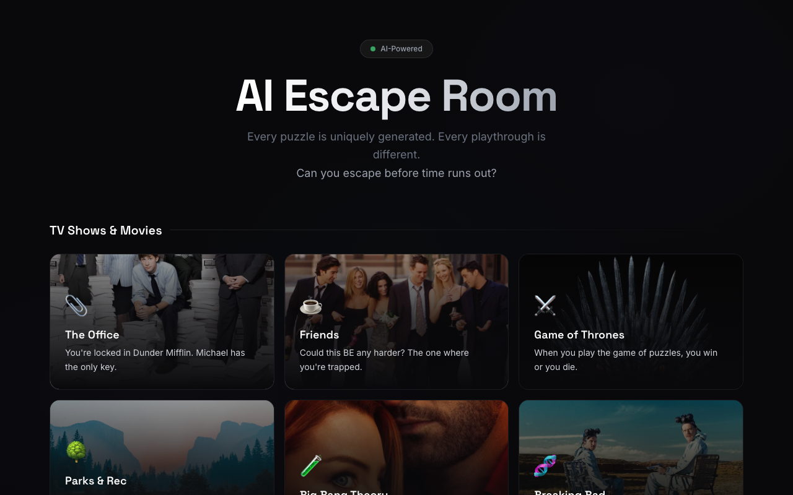
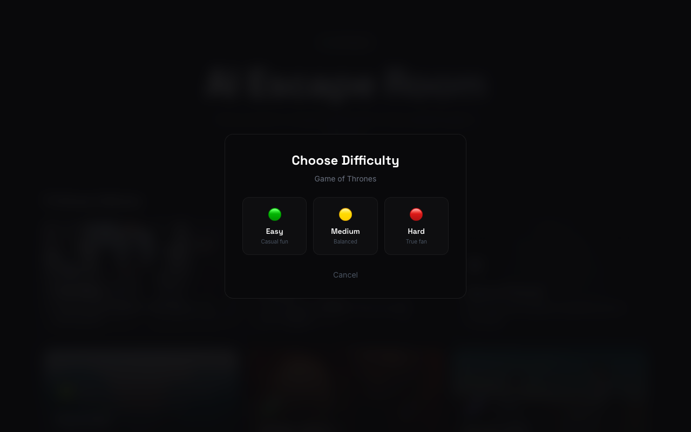

# AI Escape Room

An immersive, AI-powered escape room game. Every puzzle is uniquely generated by AI. Solve riddles, logic puzzles, visual challenges, and more to escape before time runs out.

## Screenshots

| Lobby | Game Room | Results |
|:-----:|:---------:|:-------:|
|  |  |  |
| *Choose from themed rooms or upload your own image* | *Solve AI-generated puzzles against the clock* | *See your final score and puzzle breakdown* |

## Features

- **Themed Rooms**: Multiple TV-show and movie-inspired rooms, each with its own story and atmosphere
- **Dynamic Puzzle Generation**: Every puzzle is created on-the-fly by AI — no two playthroughs are the same
- **Background Puzzle Caching**: After the first puzzle, the game pre-generates future puzzles in the background to hide AI latency
- **Reveal Answer**: Stuck? Reveal the answer in-game so you can still progress and enjoy the story
- **Multimodal Puzzles**: Upload images and let AI create visual puzzles from them
- **Adaptive Difficulty**: The AI calibrates puzzle difficulty based on your performance
- **Hint System**: Request hints when stuck (costs 60 seconds from your timer)
- **15-Minute Timer**: Race against the clock to solve all 5 puzzles

## AI Integration

This app uses an OpenAI-compatible API in several ways:

1. **Puzzle Generation** — Generates thematically appropriate puzzles with structured JSON output (question, answer, hints, narrative)
2. **Answer Validation** — Flexible semantic matching (not just string comparison) so players aren't penalized for minor typos or rephrasing
3. **Multimodal Analysis** — Players can upload images that the AI analyzes to create visual puzzles tied into the room's narrative
4. **Adaptive Game Mastering** — Difficulty adjusts dynamically based on solve times and hint usage, maintaining an engaging challenge curve

The backend is configured to use AI models via a standard OpenAI-compatible `/v1/chat/completions` endpoint; the UI only ever refers to it as “AI”.

## Tech Stack

- **Backend**: Python, Flask
- **Frontend**: Jinja2, Tailwind CSS, Vanilla JavaScript
- **AI**: OpenAI-compatible API (openai Python SDK)
- **Task runner / deps**: `uv` (Python package & virtualenv management)
- **Deployment**: AWS EC2 + Gunicorn

## Setup

```bash
# Clone the repository
git clone <repo-url>
cd escape-room-ai

# Install dependencies (uv handles Python + venv automatically)
uv sync

# Set environment variables
export API_KEY=your-api-key-here          # OpenAI-compatible API key
export FLASK_SECRET_KEY=$(python3 -c "import secrets; print(secrets.token_hex(32))")

# (Optional) Custom base URL if not using api.openai.com
export API_BASE_URL=https://your-proxy-or-endpoint.example.com/v1

# Run the app (dev)
uv run python app.py
```

By default the app runs on `http://localhost:5001`.

## Production Deployment

```bash
uv run gunicorn -w 2 -b 0.0.0.0:80 app:app
```

## How to Play

1. Choose a themed room from the lobby
2. Read each puzzle carefully and type your answer
3. Use hints if stuck (costs 60 seconds)
4. Use **Reveal** if you just want to see the answer and move on
5. Upload images to create visual puzzles (optional)
6. Solve all 5 puzzles before the 15-minute timer runs out!
